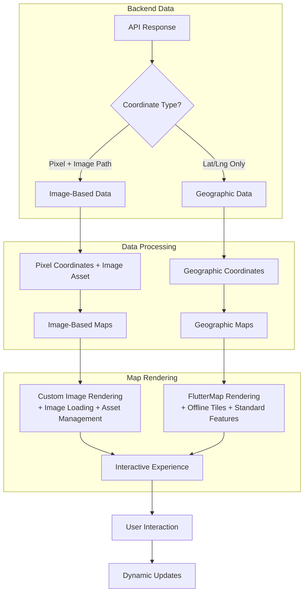

# Interactive Map Demo

A comprehensive Flutter application showcasing advanced interactive map implementations with multiple use cases including cruise destinations, ship deck plans, route-based itinerary maps, cruise catalog system, countdown widgets, and digital stateroom keys.

> **⚠️ AI-Generated**: This project was primarily generated using AI tools (Cursor with Claude Sonnet 4 and GPT-5). Please proceed with caution and thoroughly review all code before using in production environments.

## 📋 Table of Contents

- [Features](#features)
  - [Interactive Destination Map (Great Stirrup Cay)](#️-interactive-destination-map-great-stirrup-cay)
  - [Cruise Itinerary Map (Multiple Routes)](#️-cruise-itinerary-map-multiple-routes---backend-driven)
  - [Cruise Catalog Map](#️-cruise-catalog-map)
  - [Cruise Countdown Widget](#️-cruise-countdown-widget)
  - [Multi-Deck Ship Map (Norwegian Aqua)](#️-multi-deck-ship-map-norwegian-aqua)
  - [Digital Stateroom Key](#️-digital-stateroom-key)
- [Technical Details](#technical-details)
  - [Dual Map Architecture: Image-Based vs Geographic Coordinates](#dual-map-architecture-image-based-vs-geographic-coordinates)
  - [Backend Integration & Data Flow](#backend-integration--data-flow)
  - [Offline Vector Tiles & Performance Engineering](#offline-vector-tiles--performance-engineering)
  - [iOS Home Widget System](#ios-home-widget-system)
  - [Digital Key & BLE Integration](#digital-key--ble-integration)
- [Project Structure](#project-structure)
- [Licensing & Attribution](#️-licensing--attribution)
- [AI Digest](#ai-digest)

## ✨ Features

### 🏝️ Interactive Destination Map (Great Stirrup Cay)

**Great Stirrup Cay with POI markers and filtering**


- **POI Markers**: Category-based filtering with responsive zoom tiers
- **Interactive Gestures**: Pan, zoom, double-tap, long-press reset
- **Smooth Animations**: Selected markers with pulsing glow effects
- **Detail Views**: Bottom sheet dialogs with marker information
- **Widget Composition**: Small, focused, reusable widgets

### 🗺️ Cruise Itinerary Map (Multiple Routes) - **Backend-Driven**

**Backend-driven Caribbean & Transatlantic routes with automatic day positioning and path generation**

<p align="center">
  
  
</p>

<p align="center">
  
  
</p>

- **Multi-Itinerary Support**: Caribbean (7-day) and Transatlantic (15-night) cruise routes
- **Backend-Driven Positioning**: All map elements positioned using backend-provided coordinate data
- **Dynamic Route Generation**: Routes automatically generated from backend itinerary data
- **Day-by-Day Navigation**: Swipeable cards with auto-centering day indicators
- **Bidirectional Route Animation**: Smooth forward/backward animations between days
- **Smart Layout Management**: Automatic padding prevents bottom sheet from covering map content
- **Performance Optimization**: Cached image sizes, efficient marker rendering, ScrollController management

### 🌍 Cruise Catalog Map

**Interactive world map with NCL cruise routes, search, and filtering**

<p align="center">
  
  
</p>

- **Interactive World Map**: FlutterMap-based world view with NCL cruise routes
- **Dynamic Zoom Tiers**: Cruises appear/disappear based on zoom level (essential, medium, detailed)
- **Smart Cruise Selection**: Click routes to select cruises with automatic map fitting
- **Port Cycling**: Tap port markers to cycle through all cruises visiting that port
- **Advanced Search System**: Full-text search across cruise titles, ships, destinations, and ports
- **Category Filtering**: Filter cruises by region (Caribbean, Mediterranean, Europe, etc.)
- **Draggable Sheet Interface**: Collapsible bottom sheet with mode-specific content
- **Sheet Mode System**: Normal browsing, search mode, and cruise details modes
- **Spain & Portugal Cruises**: Comprehensive collection of realistic NCL itineraries

### ⏰ Cruise Countdown Widget

**iOS home screen widget with countdown timers**


- **iOS Home Screen Widget**: Native iOS widget displaying selected cruise countdown
- **Method Channel Communication**: `home_widget` package enables seamless app-to-widget data sharing
- **Interactive Countdown Timer**: Real-time countdown showing days, hours, minutes, and seconds
- **Cruise Selection**: Choose from multiple upcoming cruises to track
- **Visual Indicators**: Color-coded alerts for cruises departing soon
- **Auto-refresh**: Widget updates every hour automatically
- **App Groups Integration**: Secure data sharing between app and widget extension

### 🚢 Multi-Deck Ship Map (Norwegian Aqua)

**Norwegian Aqua deck plans with interactive polygon areas**


> **⚠️ Work in Progress**: This is a quick preview of what's possible with interactive ship deck plans. Mapping polygon/path lines to the deck plan image isn't fully implemented yet. The current demo shows the foundational architecture and UI components.

- **Multi-Deck Navigation**: Browse 16 decks (Decks 5-20) with mini-map
- **Interactive Polygons**: Clickable areas for ship facilities
- **Legend System**: Swipeable bottom sheet with facility categories
- **Multi-Ship Support**: Extensible architecture for different ship classes

### 🔑 Digital Stateroom Key

**BLE-based mobile access system for stateroom doors**

- **BLE-Based Access**: Bluetooth Low Energy communication with stateroom locks
- **ASSA ABLOY Mobile Access SDK**: Secure credential provisioning and validation
- **Bluetooth Low Energy**: Offline stateroom unlocking without internet connection
- **Dart Frog Backend**: Lightweight server for credential management
- **Device-bound Credentials**: Time-limited, secure storage with on-device encryption
- **On-Demand Provisioning**: Keys provisioned when guest requests access in-app

## 🔧 Technical Details

### Dual Map Architecture: Image-Based vs Geographic Coordinates

The project implements **two distinct interactive map types**, each optimized for different use cases and offering unique capabilities:

#### **1. Image-Based Coordinate Maps** 🖼️

**Coordinate System**: `[x, y]` pixel coordinates relative to background map images

```dart
// Backend provides itinerary with image path and pixel coordinates
CruiseItinerary(
  name: '7-Day Caribbean Cruise',
  imagePath: 'https://api.cruisecompany.com/maps/caribbean_cruise_map.png',
  days: [
    ItineraryDay(
      dayNumber: 1,
      port: PortData(
        name: 'Miami',
        coordinates: [100, 50], // x=100px, y=50px on map image
      ),
    ),
  ],
);

// App automatically positions everything using pixel coordinates
final position = _getDayPosition(dayIndex); // → Offset(100, 50)
// ✅ Marker appears at exact pixel position
// ✅ Route paths follow pixel coordinates
// ✅ Tap detection uses pixel-based hit testing
// ⚠️ Requires online image loading from imagePath
```

| ✅ **Pros**                                                               | ❌ **Cons**                                                                     |
| ------------------------------------------------------------------------- | ------------------------------------------------------------------------------- |
| **🎯 Pixel-Perfect Precision**: Exact positioning on custom map images    | **🖼️ Static Assets**: Requires custom map images for each region/route          |
| **🚀 Backend-Driven**: APIs provide coordinates, app displays immediately | **📏 Limited Scale**: Fixed resolution, no zoom-based detail levels             |
| **📱 Device Independent**: Works consistently across all screen sizes     | **🌍 Geographic Inaccuracy**: No real-world distance/position relationships     |
| **⚡ Zero Configuration**: No manual positioning or calibration needed    | **🔗 No External Integration**: Cannot integrate with standard mapping services |
| **🔄 Dynamic Updates**: Change backend data, map updates automatically    | **📊 Limited Data Sources**: Cannot use standard GIS data or APIs               |
| **🎨 Custom Visuals**: Full control over map appearance and branding      | **🔍 No Geocoding**: Cannot perform address lookup or reverse geocoding         |
| **💾 Lightweight**: Simple image loading, minimal dependencies            | **🗺️ No Standard Features**: Missing zoom, pan, geographic bounds               |

#### **2. Geographic Coordinate Maps** 🌍

**Coordinate System**: `[latitude, longitude]` real-world geographic coordinates

```dart
// Geographic coordinates for real-world locations
final miamiLocation = LatLng(25.7617, -80.1918);
final caribbeanPorts = [
  LatLng(18.4655, -66.1057), // San Juan
  LatLng(17.1899, -88.4976), // Belize City
  LatLng(19.4326, -99.1332), // Mexico City
];

FlutterMap(
  options: MapOptions(
    initialCenter: miamiLocation,
    initialZoom: 6.0,
  ),
  children: [
    CustomMapTileLayers(mapConfig: config),
    MarkerLayer(
      markers: caribbeanPorts.map((latLng) =>
        Marker(point: latLng, builder: (ctx) => PortMarker())
      ).toList(),
    ),
  ],
);
```

| ✅ **Pros**                                                                   | ❌ **Cons**                                                              |
| ----------------------------------------------------------------------------- | ------------------------------------------------------------------------ |
| **🌐 Real-World Accuracy**: True geographic positioning and distances         | **📊 Data Complexity**: Requires geographic coordinate management        |
| **🗺️ Standard Map Features**: Zoom, pan, geographic bounds, clustering        | **🔧 Configuration Overhead**: Requires map tile setup and configuration |
| **📊 Data Integration**: Works with standard GIS data and APIs                | **💾 Larger Bundle Size**: Map tiles and styles increase app size        |
| **🔍 Search & Geocoding**: Standard address lookup and reverse geocoding      | **🌍 Coordinate Management**: Requires lat/lng coordinate system         |
| **📱 Native Map Apps**: Integration with device's native mapping capabilities | **⚡ Performance Considerations**: Tile loading and rendering overhead   |
| **🌍 Global Coverage**: Access to worldwide geographic data                   | **🎨 Limited Customization**: Bound by standard map styling options      |
| **🎯 Industry Standard**: Follows established mapping conventions             | **📱 Device Variations**: May behave differently across devices          |
| **🔄 Scalable**: Works for any geographic region without custom assets        |                                                                          |

#### **Detailed Comparison Tables**

| **Feature**                | **Image-Based Maps**            | **Geographic Maps**               | **Winner**     |
| -------------------------- | ------------------------------- | --------------------------------- | -------------- |
| **Geographic Accuracy**    | ❌ Pixel coordinates only       | ✅ Real-world lat/lng             | 🌍 Geographic  |
| **Custom Branding**        | ✅ Full control                 | ⚠️ Limited by tile styles         | 🖼️ Image-Based |
| **Global Coverage**        | ❌ Requires custom images       | ✅ Worldwide data included        | 🌍 Geographic  |
| **Standard Features**      | ❌ Custom implementation needed | ✅ Built-in zoom, pan, clustering | 🌍 Geographic  |
| **Data Integration**       | ❌ Custom coordinate system     | ✅ Standard GIS data sources      | 🌍 Geographic  |
| **Search & Geocoding**     | ❌ Not available                | ✅ Built-in capabilities          | 🌍 Geographic  |
| **Native Map Integration** | ❌ No integration               | ✅ Seamless integration           | 🌍 Geographic  |
| **Bundle Size**            | ✅ Lightweight (images only)    | ⚠️ Larger (tiles + styles)        | 🖼️ Image-Based |
| **Setup Complexity**       | ✅ Simple image loading         | ⚠️ Requires configuration         | 🖼️ Image-Based |
| **Scalability**            | ❌ New images for each region   | ✅ Works everywhere               | 🌍 Geographic  |
| **Performance**            | ✅ Fast image rendering         | ⚠️ Tile loading overhead          | 🖼️ Image-Based |
| **Future-Proofing**        | ❌ Custom maintenance required  | ✅ Industry standard              | 🌍 Geographic  |

#### **🏆 Recommendation: Geographic FlutterMap Implementation**

**This approach provides the foundation for a professional, scalable cruise application that meets industry standards and user expectations. For production cruise applications, we strongly recommend the **Geographic FlutterMap approach** for the following reasons:**

##### **🎯 Key Advantages & Benefits**

- **🔄 Scalable**: Single implementation works for all cruise routes worldwide without custom assets
- **📱 Offline Capability**: Full functionality without internet connection using local vector tiles
- **📊 Rich Data**: Access to comprehensive port, weather, maritime, and local attraction data
- **🎯 User Expectations**: Matches user experience from other travel apps and mapping platforms
- **🔧 Maintainable**: Industry-standard tools, libraries, and development practices available
- **📈 Future-Proof**: Easily extensible for new features, regions, and emerging technologies
- **📱 Native Integration**: Works with device GPS, navigation apps, location services, and native map applications
- **🔍 Search Capabilities**: Enables port search, distance calculations, route planning, and geocoding
- **📊 Data Integration**: Seamlessly integrates with existing cruise booking, navigation, and port management systems

##### **💡 Best Use Cases for Each Approach**

| **Use Case**                | **Recommended Approach** | **Reasoning**                                           |
| --------------------------- | ------------------------ | ------------------------------------------------------- |
| **Cruise Itinerary Maps**   | 🌍 Geographic FlutterMap | Real-world accuracy, global coverage, industry standard |
| **Cruise Catalog/Booking**  | 🌍 Geographic FlutterMap | Search integration, port information, route planning    |
| **Custom Destination Maps** | 🖼️ Image-Based           | Branded resort/island maps with custom POIs             |
| **Ship Deck Plans**         | 🖼️ Image-Based           | Architectural layouts, facility locations               |
| **Interactive Port Guides** | 🌍 Geographic FlutterMap | Real-world navigation, local attractions                |
| **Cruise Route Planning**   | 🌍 Geographic FlutterMap | Distance calculations, weather integration              |

### Backend Integration & Data Flow

The system supports **both coordinate types** for backend integration:



### Offline Vector Tiles & Performance Engineering

**FlutterMap Geographic Mapping Excellence**: Our **offline vector tile system** demonstrates the power and flexibility of FlutterMap-based geographic mapping, offering unparalleled customization while maintaining exceptional performance.

**Massive Data Optimization**: Transformed a 75GB world map into a 50MB cruise-focused database through strategic zoom level pruning and geographic targeting.

#### **Data Optimization & Performance**

- **99.93% Size Reduction**: 75GB world map → 50MB cruise-optimized database
- **Strategic Zoom Targeting**: Levels 3-6 cover 100% of cruise routes and destinations
- **Zero Network Dependency**: Perfect offline functionality with instant loading
- **Offline Reliability**: 100% uptime without network dependency
- **Cost Effective**: No data charges or roaming fees for map usage
- **Privacy Enhanced**: No location data sent to external servers

#### **FlutterMap Customization & Capabilities**

- **Complete Visual Control**: Customize colors, fonts, icons, and styling
- **Geographic Targeting**: Include only relevant regions and exclude unnecessary areas
- **Brand Integration**: Match your app's design language and branding perfectly
- **Performance Tuning**: Optimize tile loading, caching, and rendering for your use case
- **Flexible Configuration**: Adjust map behavior, interactions, and features as needed
- **Vector Tile Caching**: Pre-loaded tiles for instant rendering
- **GPU Acceleration**: 60fps smooth pan/zoom performance
- **Memory Management**: Intelligent tile eviction and reloading
- **Cruise Ship Ready**: Perfect for maritime environments with limited connectivity
- **Custom Tile Provider**: Specialized tile providers for different data sources

## 📁 Project Structure

```
assets/
├── gifs/                               # Demo GIFs for README
│   ├── great-stirrup-cay.gif           # Interactive destination map demo (31MB)
│   ├── caribbean-cruise.gif            # 7-day Caribbean cruise demo (8MB)
│   ├── transatlantic-cruise.gif        # 15-day Transatlantic cruise demo (6.4MB)
│   ├── 7-day-caribbean-cruise-flutter-map.gif # FlutterMap Caribbean demo (6.1MB)
│   ├── 15-day-transatlantic-cruise-flutter-map.gif # FlutterMap Transatlantic demo (10MB)
│   ├── ncl-aqua-deck-plan.gif          # Norwegian Aqua deck plan demo (13MB)
│   ├── cruise-catalog.gif              # Cruise catalog demo (56MB)
│   ├── cruise-catalog-search.gif       # Cruise catalog search demo (7.6MB)
│   └── home-widget.gif                 # iOS home widget demo (18MB)
├── images/
│   ├── map.jpg                         # Great Stirrup Cay map (1.8MB)
│   ├── caribbean_cruise_map.png        # Caribbean route map (20KB)
│   ├── norwegian_pearl_transatlantic_map.png  # Transatlantic route map (20KB)
│   ├── cruise-ship.svg                 # Cruise ship icon
│   └── deck-8.svg                      # Ship deck plan
├── styles/                             # Vector tile styles and fonts
│   ├── style.json                      # MapTiler-based vector style
│   ├── fonts/                          # Font files for vector tiles
│   │   ├── Noto Sans Bold/
│   │   └── Noto Sans Regular/
│   └── sprites/                        # Sprite files for vector tiles
└── tiles/                              # Offline vector tiles
    └── planet_map.mbtiles              # MBTiles vector tile database

lib/
├── common/                             # Shared utilities and configurations
│   ├── map_config.dart                 # Unified map configuration system
│   ├── map_utilities.dart              # Map utility functions
│   ├── mbtiles/
│   │   └── mbtiles_vector_tile_provider.dart # MBTiles vector tile provider
│   └── widgets/
│       ├── custom_draggable_sheet.dart
│       ├── custom_map_tile_layers.dart
│       ├── custom_marker.dart
│       ├── custom_polyline_layer.dart
│       └── custom_sticky_header_delegate.dart
├── countdown_widget/                   # iOS home screen widget
│   ├── countdown_modal.dart           # Bottom sheet modal for cruise selection
│   ├── models/
│   │   └── cruise_countdown.dart      # Cruise countdown data model
│   └── widgets/
│       └── simple_countdown_widget.dart # Countdown timer widget
├── cruise_catalog/                     # Cruise catalog system
│   ├── cruise_catalog.dart            # Main cruise catalog widget
│   ├── data/
│   │   └── ncl_cruise_catalog.dart    # NCL cruise catalog data
│   ├── models/
│   │   ├── cruise_category.dart       # Cruise region categories
│   │   ├── cruise_product.dart        # Cruise product model
│   │   ├── cruise_route.dart          # Cruise route and waypoints
│   │   └── sheet_mode.dart            # Sheet mode and position enums
│   └── widgets/
│       ├── cruise_details_mode_header.dart
│       ├── cruise_details_mode_sheet.dart  # Cruise details content
│       ├── cruise_itinerary_preview.dart
│       ├── cruise_route_overlay.dart  # Route rendering on map
│       ├── normal_mode_header.dart
│       ├── normal_mode_sheet.dart     # Normal browsing content
│       ├── search_mode_header.dart
│       └── search_mode_sheet.dart     # Search results content
├── deck_plan/                          # Ship deck plan maps
│   ├── multi_deck_ship_map.dart       # Core deck map widget
│   ├── models/
│   │   ├── deck_polygon_data.dart
│   │   └── ship_deck_data.dart
│   └── widgets/
│       ├── deck_key_legend.dart
│       ├── deck_mini_map.dart
│       └── deck_polygon_overlay.dart
├── digital_key/                        # Digital stateroom key system
│   ├── digital_key_page.dart          # Main digital key interface
│   ├── models/
│   │   └── stateroom_access_data.dart # Stateroom access data model
│   └── widgets/
│       └── stateroom_access_page.dart # Stateroom access widget
├── interactive_map/                    # Great Stirrup Cay destination map
│   ├── interactive_map.dart           # Main interactive map widget
│   ├── models/
│   │   └── interactive_map_marker_data.dart
│   ├── pages/
│   │   └── marker_details_page.dart
│   └── widgets/
│       ├── interactive_map_error.dart
│       ├── interactive_map_filter.dart
│       ├── interactive_map_legend.dart
│       ├── interactive_map_marker.dart
│       └── interactive_map_marker_detail.dart
├── itinerary/                          # Cruise itinerary and route maps
│   ├── data/                           # Sample itinerary data files
│   │   ├── caribbean_cruise.dart       # Norwegian Aqua 7-day Caribbean cruise
│   │   └── transatlantic_cruise.dart   # Norwegian Pearl 15-night Transatlantic cruise
│   ├── models/
│   │   └── cruise_itinerary.dart       # Core models (CruiseItinerary, PortData, ItineraryDay)
│   ├── pages/
│   │   └── cruise_itinerary_page.dart
│   └── widgets/
│       ├── cruise_route_painter.dart   # Custom route visualization painter
│       ├── info_tile.dart
│       ├── itinerary_bottom_section.dart  # Draggable bottom sheet with auto-scrolling day indicators
│       ├── itinerary_map.dart          # Main route map widget
│       ├── itinerary_table.dart
│       ├── port_day_info.dart
│       ├── port_marker.dart            # Extracted marker widget with complex styling
│       └── sea_day_info.dart
├── itinerary_map/                      # Enhanced itinerary map system
│   ├── data/                           # Enhanced itinerary data
│   │   ├── caribbean_cruise.dart       # Caribbean cruise data
│   │   ├── transatlantic_cruise.dart   # Transatlantic cruise data
│   │   └── world_samples.dart          # Global cruise samples (Alaska, Mediterranean, etc.)
│   ├── itinerary_map.dart             # Main itinerary map widget
│   ├── itinerary_map_controller.dart  # Map controller for interactions
│   ├── models/
│   │   └── cruise_itinerary.dart       # Enhanced cruise itinerary models
│   └── widgets/
│       ├── info_widgets/
│       │   ├── info_tile.dart
│       │   ├── port_day_info.dart
│       │   └── sea_day_info.dart
│       ├── itinerary_map_bottom_sheet.dart
│       ├── itinerary_map_markers.dart
│       ├── itinerary_map_polylines.dart
│       └── itinerary_map_tile_layers.dart
└── main.dart                           # App entry point and navigation
```

## ⚖️ Licensing & Attribution

This project uses **fully offline mapping** with local vector tiles and styles. Review the following licensing requirements before shipping commercially:

### **Style License: OSM Liberty (BSD License)**

- **Style**: `assets/styles/style.json` uses **OSM Liberty** style (not MapTiler Basic)
- **License**: BSD License (derived from Mapbox Open Styles)
- **Usage**: ✅ **FREE** for commercial use with attribution
- **Requirements**: Must retain copyright notice and attribution

### **Data Source: OpenMapTiles (CC-BY 4.0)**

- **Data**: `assets/tiles/planet_map.mbtiles` contains OpenMapTiles vector data
- **License**: Creative Commons Attribution 4.0 (CC-BY 4.0)
- **Usage**: ✅ **FREE** for commercial use with attribution
- **Requirements**: Must credit OpenMapTiles and OpenStreetMap contributors

### **Required Attribution (MANDATORY)**

You **MUST** display the following attribution on all map screens:

```
© OpenMapTiles (https://openmaptiles.org/)
© OpenStreetMap contributors (https://www.openstreetmap.org/copyright)
```

### **Implementation Required**

Add an attribution overlay to your FlutterMap widgets:

```dart
FlutterMap(
  // ... your existing map configuration
  children: [
    // ... your existing layers
    AttributionWidget.defaultWidget(
      source: '© OpenMapTiles (https://openmaptiles.org/) © OpenStreetMap contributors (https://www.openstreetmap.org/copyright)',
      onSourceTapped: () {},
    ),
  ],
)
```

## 🤖 AI Digest

### Quick Project Understanding

**Purpose**: Flutter demo showcasing six interactive map implementations, with **primary focus on backend-driven itinerary maps** that automatically generate from API data, plus **cruise catalog system**, **iOS home widgets**, and **digital stateroom keys**.

**Key Innovation**: **Backend-Driven Map System**

- Backend provides daily itinerary locations as `[x, y]` pixel coordinates
- App automatically positions markers, draws route paths, enables navigation
- Zero hardcoding - all positioning is data-driven and updates dynamically

**Key Components**:

- `InteractiveMap`: POI-based map with markers and filtering
- `MultiDeckShipMap`: Deck plans with polygon interactions (work in progress)
- `ItineraryMap`: **Backend-driven** route map with automatic positioning
- `CruiseCatalogMap`: Interactive world map with NCL cruise routes and search
- `CountdownWidget`: iOS home screen widget with cruise countdown timers
- `DigitalKeyPage`: BLE-based stateroom access system

**Coordinate System**: Image-based `[x, y]` pixel coordinates designed for backend integration.

- Coordinates are pixel positions on map images (e.g., `[100, 50]`)
- Backend APIs provide coordinates, app displays immediately
- Single source of truth: `_getDayPosition(dayIndex)` controls all positioning

**Architecture**: Backend-driven positioning with unified coordinate system.

- All map elements (markers, routes, taps) use same position calculation
- `_generateRoutePositions()` creates paths from day coordinates
- Dynamic updates when backend data changes
- **Centralized Scroll Management**: Single CustomScrollView with unified controller
- **Content-Only Widgets**: Separated content from scroll management for better animations

**File Structure**: Eight main modules (`common/`, `countdown_widget/`, `cruise_catalog/`, `deck_plan/`, `digital_key/`, `interactive_map/`, `itinerary/`, `itinerary_map/`) with models, pages, and widgets subdirectories, organized alphabetically.

**Entry Point**: `main.dart` → `Home` → Individual feature implementations.

**Dependencies**: Flutter setup with `flutter_map`, `latlong2`, `flutter_map_animations`, `vector_map_tiles`, `mbtiles`, `home_widget`, `jovial_svg` for comprehensive feature support.

**Assets**: `assets/gifs/` (demo GIFs for README), `assets/images/` (maps, icons, deck plans), `assets/styles/` (vector tile styles and fonts), `assets/tiles/` (offline MBTiles database).

**Demo GIFs**: Visual demonstrations integrated within feature sections, available in `assets/gifs/`:

- `great-stirrup-cay.gif` (31MB) - Interactive destination map with POI filtering
- `caribbean-cruise.gif` (8MB) - 7-day Caribbean cruise route with day navigation
- `transatlantic-cruise.gif` (6.4MB) - 15-night transatlantic cruise with auto-scrolling indicators
- `7-day-caribbean-cruise-flutter-map.gif` (6.1MB) - FlutterMap Caribbean demo
- `15-day-transatlantic-cruise-flutter-map.gif` (10MB) - FlutterMap Transatlantic demo
- `ncl-aqua-deck-plan.gif` (13MB) - Multi-deck ship navigation with interactive polygons
- `cruise-catalog.gif` (56MB) - Cruise catalog system demo
- `cruise-catalog-search.gif` (7.6MB) - Cruise catalog search functionality
- `home-widget.gif` (18MB) - iOS home screen widget demonstration

**Performance**: Cached image sizes, efficient rendering, zoom-based visibility, minimal rebuilds, centralized scroll management.

**State**: Local `StatefulWidget` state, `TransformationController` for map interactions, `AnimationController` for transitions, sheet mode management, widget data persistence.

**Backend Integration & Animation**:

- JSON API provides itinerary days with embedded coordinates
- `CruiseItinerary.fromApi()` parses backend data
- Modular data architecture with separate files per cruise type (`CaribbeanCruiseData`, `TransatlanticCruiseData`)
- `_getDayPosition()` converts coordinates to screen positions
- `_generateRoutePositions()` creates curved route paths from day coordinates
- `CruiseRoutePainter` handles all route visualization and animations
- Auto-scrolling day indicators with smooth ScrollController animations
- Bidirectional route animations (forward fill, backward unfill)
- Automatic map generation with smooth navigation transitions
- **Advanced Layout Management**: Dual-viewport system with 250px natural padding prevents UI overlay conflicts
- **No White Space Guarantee**: Calculated minimum scale ensures map always fills entire viewport
- **Smart Boundary Logic**: Padded coordinate system maintains proper constraints and interactions
- **Cruise Catalog System**: Interactive world map with NCL routes, search, and filtering
- **Centralized Scroll Management**: Single CustomScrollView with unified controller for all sheet modes
- **Content-Only Architecture**: Separated content widgets from scroll management for better animations
- **Widget Integration**: iOS home screen widget with method channel communication
- **Digital Key System**: BLE-based stateroom access with ASSA ABLOY Mobile Access SDK
- **Offline Vector Tiles**: Local MBTiles support for offline map functionality
- **Fully Offline Implementation**: No external tile servers, all mapping data is local
- **Platform Focus**: iOS and Android only (removed web, desktop, and test platforms)
