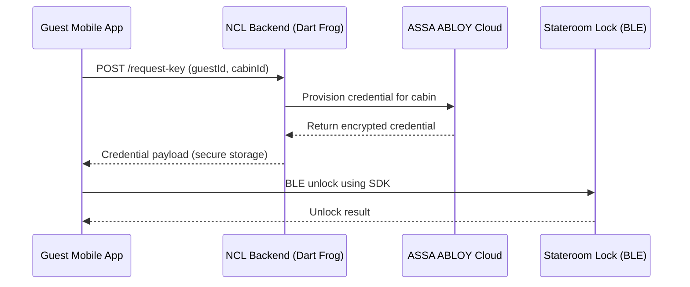
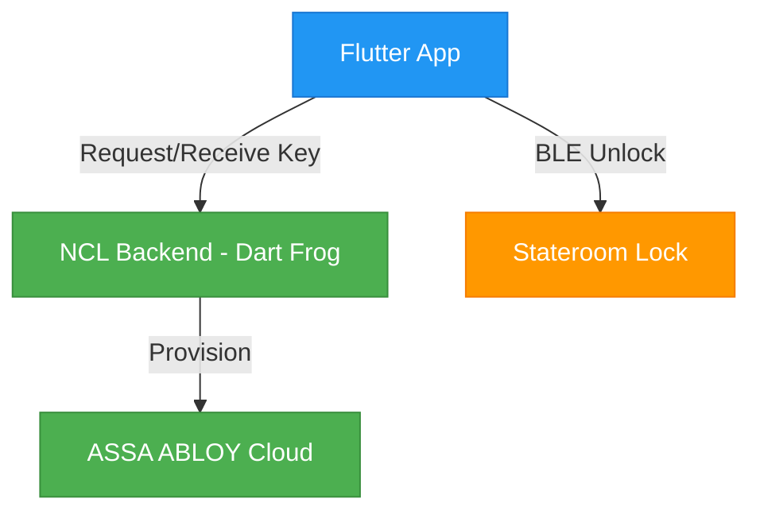

# 🛳 NCL Digital Stateroom Key (Mobile Access MVP)

This document presents a cohesive plan to bring the physical stateroom key card experience into the NCL mobile app, enabling guests to unlock their doors via smartphone using secure Bluetooth Low Energy (BLE) credentials provisioned through ASSA ABLOY Mobile Access.

## 🎯 Goal
Enable guests to use the NCL app as a digital stateroom key (BLE). Physical cards remain as a fallback throughout rollout.
- **Guest experience**: Tap-to-unlock convenience; modern, app-first journey
- **Operations**: Fewer lost-card incidents; lower card production/replacement costs
- **Security**: Time-bound, device-bound credentials with complete audit trails
- **Scalability**: Leverages existing lock infrastructure; rollout ship-by-ship

## ✅ MVP Highlights
- Flutter app integrates with ASSA ABLOY Mobile Access SDK (native iOS & Android).
- Thin backend (built with Dart Frog) provisions keys securely via ASSA ABLOY Cloud.
- BLE handshake unlocks staterooms — no internet needed after provisioning.
- Unlocking is local; provisioning is server-triggered on demand.

## 🔐 ASSA ABLOY Overview (Vendor Ecosystem)
ASSA ABLOY Global Solutions provides ship- and hotel-grade smart locks and mobile access credentials (e.g., VingCard). Their platform supports secure mobile key provisioning and BLE door unlock.
- Product overview: [ASSA ABLOY Mobile Access](https://www.assaabloyglobalsolutions.com/en/solutions/mobile-access)
- Company site: [ASSA ABLOY Global Solutions](https://www.assaabloyglobalsolutions.com)
- SDK/Developer access: Partner documentation available via ASSA ABLOY (contact sales/support to request SDK access)

## 🧭 MVP Approach (Request-on-Demand Provisioning)
Instead of issuing mobile keys to everyone automatically, keys are provisioned on-demand when the guest requests one in the app. This reduces complexity and cost while proving value quickly.
- Guest taps “Get Digital Key” in-app
- NCL backend verifies guest ↔ stateroom mapping
- Backend requests a mobile credential from ASSA ABLOY
- App receives credential and stores it securely
- Unlock flows offline via BLE (no internet required at the door)

## 🔐 System Architecture

## 🧱 Architecture (Concise)

- **Mobile app**: Flutter UI, native iOS/Android Mobile Access SDKs via platform channels
- **Backend**: Lightweight Dart Frog API to validate guests and request credentials
- **Locks**: Existing ASSA ABLOY/VingCard hardware with BLE enabled

## 🐸 Dart Frog (Intro)
Dart Frog is a lightweight server framework for building fast Dart backends. It’s ideal here as a simple API proxy between the NCL app and ASSA ABLOY’s provisioning endpoints.
- Website: [dartfrog.vgv.dev](https://dartfrog.vgv.dev)
- Benefits: small footprint, fast startup, simple routing, great for serverless

### Deployment Strategy (Serverless-first)
- Package Dart Frog as a container and deploy to one of:
  - Google Cloud Run (recommended), AWS Lambda (via API Gateway), Azure Container Apps, or NCL internal Kubernetes
- Configure secrets via provider Secret Manager (ASSA ABLOY API keys, environment)

## 💵 Cost & Licensing Breakdown
There are no Apple/Google per-use fees for mobile keys. Costs center on lock vendor licensing and minimal backend hosting.
- No Apple/Google per-use fees for digital keys
- Licensing is primarily with ASSA ABLOY (per-lock subscription or per-credential models)
- Backend is lightweight; can run cost-effectively on serverless

| Item | Fee Type | Notes |
| --- | --- | --- |
| ASSA ABLOY Mobile Access | Vendor license | SDKs, cloud provisioning, support |
| Credential Issuance | Per-credential or per-lock | Cruise fleets often use per-lock/ship subscriptions |
| Backend (Dart Frog) | Serverless runtime | Pennies/day at pilot scale |
| Apple/Google Wallet (future) | $0 | No pass issuance fee |

Recommendation: negotiate per-lock (or per-ship) subscription; avoid per-credential costs at fleet scale.

## 🔒 Security Highlights
- Device-bound, time-limited credentials; on-device secure storage (Keychain/Keystore)
- Encrypted provisioning over trusted channel from NCL backend to ASSA ABLOY
- No direct ASSA ABLOY calls from the app; credentials never exposed in logs
- Full audit trail of provisioning and unlock attempts

## 📊 Success Metrics
- Adoption rate vs. physical cards
- Unlock success rate and time-to-unlock
- Reduction in card replacement incidents
- Guest satisfaction (CSAT/NPS) for access experience

## ▶️ Next Steps
1. Confirm ASSA ABLOY lock models/ship readiness and obtain SDK access
2. Stand up minimal Dart Frog backend with ship/guest eligibility checks
3. Integrate native SDKs via Flutter platform channels; build pilot UI

## 🔗 Resources
- ASSA ABLOY Mobile Access: [https://www.assaabloyglobalsolutions.com/en/solutions/mobile-access](https://www.assaabloyglobalsolutions.com/en/solutions/mobile-access)
- ASSA ABLOY Global Solutions: [https://www.assaabloyglobalsolutions.com](https://www.assaabloyglobalsolutions.com)
- Contact for SDK access/support: [ASSA ABLOY Global Solutions — Contact](https://www.assaabloyglobalsolutions.com/en/support/contact)
- Dart Frog: [https://dartfrog.vgv.dev](https://dartfrog.vgv.dev)
- Flutter: [https://flutter.dev](https://flutter.dev)
- Apple Wallet (keys): [https://developer.apple.com/wallet/](https://developer.apple.com/wallet/)
- Google Wallet (keys): [https://developers.google.com/wallet](https://developers.google.com/wallet)
- Source discussion: [ChatGPT conversation](https://chatgpt.com/share/68a92828-08b8-800a-98fd-abb7f29c066a)
