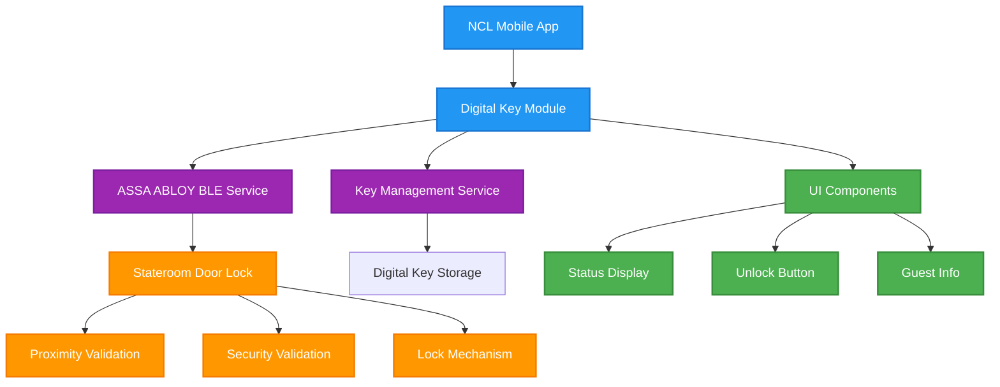
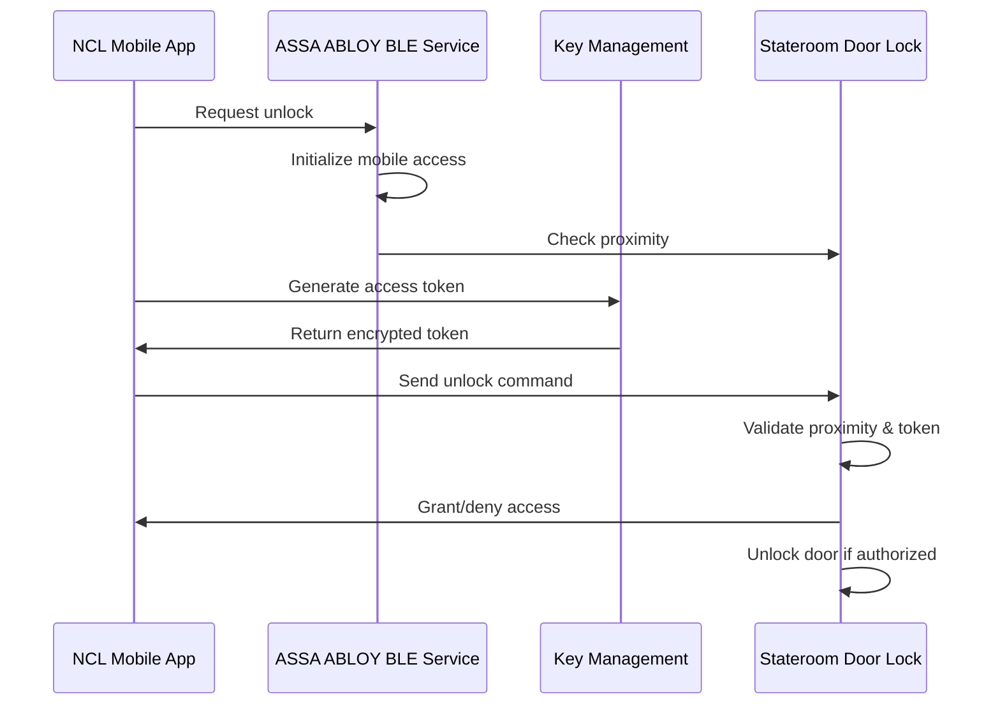

# Norwegian Cruise Line Digital Stateroom Key (Mobile Access MVP)

## Table of Contents

- [Overview](#overview)
- [MVP Implementation Guide](#mvp-implementation-guide)
- [Technical Architecture](#technical-architecture)
- [Implementation Steps](#implementation-steps)
- [Code Examples](#code-examples)
- [Security Considerations](#security-considerations)
- [File Structure](#file-structure)
- [Dependencies](#dependencies)
- [Cost & Licensing](#cost--licensing)

---

## Overview

This document provides a comprehensive guide for implementing a Mobile Access MVP for Norwegian Cruise Line's digital stateroom key system. The MVP enables guests to unlock their stateroom doors using the NCL mobile app with secure Bluetooth Low Energy (BLE) credentials provisioned through ASSA ABLOY Mobile Access.

### 🎯 Goal
Enable guests to unlock their stateroom doors using the NCL app as a digital key. Physical cards remain as a fallback throughout rollout.
- **Guest experience**: Tap-to-unlock convenience; modern, app-first journey
- **Operations**: Fewer lost-card incidents; lower card production/replacement costs
- **Security**: Time-bound, device-bound credentials with complete audit trails
- **Scalability**: Leverages existing lock infrastructure; rollout ship-by-ship

### ✅ MVP Highlights
- Flutter app integrates with ASSA ABLOY Mobile Access SDK (native iOS & Android)
- Thin backend (built with Dart Frog) provisions keys securely via ASSA ABLOY Cloud
- BLE handshake unlocks staterooms — no internet needed after provisioning
- Unlocking is local; provisioning is server-triggered on demand

### Technology Stack

- **Frontend**: Flutter (Dart)
- **Backend**: Dart Frog (lightweight server framework)
- **BLE Communication**: ASSA ABLOY Mobile Access SDK
- **State Management**: Provider/Riverpod
- **Security**: Device-bound, time-limited credentials
- **Lock Integration**: ASSA ABLOY VingCard Hospitality Series

---

## MVP Implementation Guide

### Phase 1: Basic UI Implementation

#### Step 1: Create the Main Stateroom Unlock Page

```dart
// lib/digital_key/stateroom_unlock_page.dart
import 'package:flutter/material.dart';
import 'package:provider/provider.dart';
import 'models/stateroom_access_data.dart';

class StateroomUnlockPage extends StatelessWidget {
  const StateroomUnlockPage({super.key});

  @override
  Widget build(BuildContext context) {
    return Scaffold(
      appBar: AppBar(
        title: const Text('Unlock Stateroom'),
        backgroundColor: Theme.of(context).colorScheme.primary,
        foregroundColor: Theme.of(context).colorScheme.onPrimary,
      ),
      body: const StateroomUnlockContent(),
    );
  }
}

class StateroomUnlockContent extends StatelessWidget {
  const StateroomUnlockContent({super.key});

  @override
  Widget build(BuildContext context) {
    return Consumer<StateroomAccessData>(
      builder: (context, accessData, child) {
        return Padding(
          padding: const EdgeInsets.all(24.0),
          child: Column(
            children: [
              const GuestInfoSection(),
              const SizedBox(height: 32),
              const StateroomStatusCard(),
              const SizedBox(height: 24),
              const UnlockButton(),
              const SizedBox(height: 24),
              const UnlockInstructions(),
            ],
          ),
        );
      },
    );
  }
}
```


### Phase 2: Data Models and State Management

#### Step 1: Create Access Status Enum

```dart
// lib/digital_key/models/stateroom_access_data.dart
enum AccessStatus {
  locked,
  unlocking,
  unlocked,
}

class StateroomAccessData extends ChangeNotifier {
  String _guestName = 'John Smith';
  String _stateroomNumber = '1234';
  String _deckNumber = '8';
  AccessStatus _status = AccessStatus.locked;
  bool _isUnlocking = false;

  // Getters
  String get guestName => _guestName;
  String get stateroomNumber => _stateroomNumber;
  String get deckNumber => _deckNumber;
  AccessStatus get status => _status;
  bool get isUnlocking => _isUnlocking;

  Future<void> unlockStateroom() async {
    if (_isUnlocking) return;

    _isUnlocking = true;
    _status = AccessStatus.unlocking;
    notifyListeners();

    try {
      final bool success = await _bleService.unlockStateroom(_stateroomNumber);
      
      if (success) {
        _status = AccessStatus.unlocked;
        // Auto-lock after 30 seconds
        Future.delayed(const Duration(seconds: 30), () {
          _status = AccessStatus.locked;
          notifyListeners();
        });
      } else {
        _status = AccessStatus.locked;
      }
    } catch (e) {
      _status = AccessStatus.locked;
    } finally {
      _isUnlocking = false;
      notifyListeners();
    }
  }
}
```

### Phase 3: BLE Integration (MVP with ASSA ABLOY SDK)

#### Step 1: Add BLE Dependencies

```yaml
# pubspec.yaml
dependencies:
  flutter:
    sdk: flutter
  provider: ^6.1.1
  permission_handler: ^11.3.0
  # ASSA ABLOY Mobile Access SDK will be added via platform channels
```

#### Step 2: Create ASSA ABLOY BLE Service

```dart
// lib/digital_key/services/assa_abloy_ble_service.dart
import 'package:permission_handler/permission_handler.dart';
import 'package:flutter/services.dart';

class AssaAbloyBleService {
  static final AssaAbloyBleService _instance = AssaAbloyBleService._internal();
  factory AssaAbloyBleService() => _instance;
  AssaAbloyBleService._internal();

  static const MethodChannel _channel = MethodChannel('assa_abloy_mobile_access');

  Future<bool> unlockStateroom(String stateroomNumber) async {
    try {
      final bool result = await _channel.invokeMethod('unlockStateroom', {
        'stateroomNumber': stateroomNumber,
      });
      return result;
    } catch (e) {
      print('ASSA ABLOY unlock error: $e');
      return false;
    }
  }
}
```


### Phase 4: Security Implementation

#### Step 1: Create Digital Key Model

```dart
// lib/digital_key/models/digital_key.dart
import 'dart:convert';
import 'package:crypto/crypto.dart';

class DigitalKey {
  final String guestId;
  final String stateroomNumber;
  final DateTime validFrom;
  final DateTime validUntil;
  final String encryptedCredential;

  DigitalKey({
    required this.guestId,
    required this.stateroomNumber,
    required this.validFrom,
    required this.validUntil,
    required this.encryptedCredential,
  });

  bool get isValid {
    final now = DateTime.now();
    return now.isAfter(validFrom) && now.isBefore(validUntil);
  }

  String generateAccessToken() {
    final data = '$guestId:$stateroomNumber:${DateTime.now().millisecondsSinceEpoch}';
    final bytes = utf8.encode(data);
    final digest = sha256.convert(bytes);
    return digest.toString();
  }
}
```


---

## Technical Architecture

### System Components



### Unlock Flow



---

## Implementation Steps

### 1. Project Setup

1. **Add Dependencies** to `pubspec.yaml`:
   ```yaml
   dependencies:
     provider: ^6.1.1
     permission_handler: ^11.3.0
     crypto: ^3.0.3
     # ASSA ABLOY Mobile Access SDK will be added via platform channels
   ```

2. **Configure Permissions**:
   - Android: Add permissions to `android/app/src/main/AndroidManifest.xml`
   - iOS: Add permissions to `ios/Runner/Info.plist`

### 2. Create File Structure

```
lib/digital_key/
├── stateroom_unlock_page.dart
├── models/
│   ├── stateroom_access_data.dart
│   └── digital_key.dart
├── services/
│   ├── assa_abloy_ble_service.dart
│   └── key_management_service.dart
├── widgets/
│   ├── guest_info_section.dart
│   ├── stateroom_status_card.dart
│   ├── unlock_button.dart
│   └── unlock_instructions.dart
└── README.md
```

### 3. Implementation Order

1. **Basic UI Components** (Phase 1)
2. **Data Models** (Phase 2)
3. **ASSA ABLOY BLE Integration** (Phase 3)
4. **Security Features** (Phase 4)

### 4. Integration with Main App

```dart
// lib/main.dart
import 'package:provider/provider.dart';
import '../digital_key/models/stateroom_access_data.dart';

void main() {
  runApp(
    MultiProvider(
      providers: [
        ChangeNotifierProvider(create: (_) => StateroomAccessData()),
      ],
      child: const MyApp(),
    ),
  );
}
```

---

## Code Examples

### Main Stateroom Unlock Page

```dart
// lib/digital_key/stateroom_unlock_page.dart
class StateroomUnlockPage extends StatelessWidget {
  const StateroomUnlockPage({super.key});

  @override
  Widget build(BuildContext context) {
    return Scaffold(
      appBar: AppBar(
        title: const Text('Unlock Stateroom'),
        backgroundColor: Theme.of(context).colorScheme.primary,
        foregroundColor: Theme.of(context).colorScheme.onPrimary,
      ),
      body: Consumer<StateroomAccessData>(
        builder: (context, accessData, child) {
          return Padding(
            padding: const EdgeInsets.all(24.0),
            child: Column(
              children: [
                const GuestInfoSection(),
                const SizedBox(height: 32),
                const StateroomStatusCard(),
                const SizedBox(height: 24),
                const UnlockButton(),
              ],
            ),
          );
        },
      ),
    );
  }
}
```

### Core Data Model

```dart
// lib/digital_key/models/stateroom_access_data.dart
class StateroomAccessData extends ChangeNotifier {
  String _guestName = 'John Smith';
  String _stateroomNumber = '1234';
  String _deckNumber = '8';
  AccessStatus _status = AccessStatus.locked;
  bool _isUnlocking = false;

  String get guestName => _guestName;
  String get stateroomNumber => _stateroomNumber;
  String get deckNumber => _deckNumber;
  AccessStatus get status => _status;
  bool get isUnlocking => _isUnlocking;

  Future<void> unlockStateroom() async {
    if (_isUnlocking) return;

    _isUnlocking = true;
    _status = AccessStatus.unlocking;
    notifyListeners();

    try {
      final bool success = await _bleService.unlockStateroom(_stateroomNumber);
      
      if (success) {
        _status = AccessStatus.unlocked;
        // Auto-lock after 30 seconds
        Future.delayed(const Duration(seconds: 30), () {
          _status = AccessStatus.locked;
          notifyListeners();
        });
      } else {
        _status = AccessStatus.locked;
      }
    } catch (e) {
      _status = AccessStatus.locked;
    } finally {
      _isUnlocking = false;
      notifyListeners();
    }
  }
}
```

---


---

## Security Considerations

### 1. Digital Key Security

- **Time-Limited Keys**: Keys expire at end of cruise
- **Device-Bound Credentials**: Keys tied to specific device
- **Encrypted Storage**: Keys stored securely in app (Keychain/Keystore)
- **Tamper Detection**: Prevent unauthorized access attempts

### 2. ASSA ABLOY BLE Communication

- **Encrypted Transmission**: All BLE communication encrypted
- **Proximity Validation**: Must be physically near door lock
- **Authentication Tokens**: Secure token-based authentication
- **Vendor Security**: Leverages ASSA ABLOY's proven security framework

### 3. Privacy Protection

- **Minimal Data Collection**: Only essential guest information
- **Local Processing**: Unlock processed locally when possible
- **Audit Trail**: Log access attempts for security monitoring

### 4. Compliance

- **Maritime Security**: Meets cruise ship security standards
- **Data Protection**: Complies with privacy regulations
- **Access Control**: Proper authorization and authentication

---

## File Structure

```
lib/digital_key/
├── README.md                           # This documentation
├── stateroom_unlock_page.dart          # Main page component
├── models/
│   ├── stateroom_access_data.dart      # State management
│   └── digital_key.dart               # Digital key model
├── services/
│   ├── assa_abloy_ble_service.dart    # ASSA ABLOY BLE communication
│   └── key_management_service.dart    # Key management
└── widgets/
    ├── guest_info_section.dart        # Guest information display
    ├── stateroom_status_card.dart     # Status display card
    ├── unlock_button.dart             # Unlock button
    └── unlock_instructions.dart       # Usage instructions
```

---

## Dependencies

### Required Packages

```yaml
dependencies:
  flutter:
    sdk: flutter
  provider: ^6.1.1                    # State management
  permission_handler: ^11.3.0         # Permission handling
  crypto: ^3.0.3                      # Encryption utilities
  # ASSA ABLOY Mobile Access SDK will be added via platform channels
```

### Platform Permissions

#### Android (`android/app/src/main/AndroidManifest.xml`)
```xml
<uses-permission android:name="android.permission.BLUETOOTH" />
<uses-permission android:name="android.permission.BLUETOOTH_ADMIN" />
<uses-permission android:name="android.permission.BLUETOOTH_SCAN" />
<uses-permission android:name="android.permission.BLUETOOTH_CONNECT" />
<uses-permission android:name="android.permission.ACCESS_FINE_LOCATION" />
<uses-permission android:name="android.permission.ACCESS_COARSE_LOCATION" />
```

#### iOS (`ios/Runner/Info.plist`)
```xml
<key>NSBluetoothAlwaysUsageDescription</key>
<string>This app uses Bluetooth to unlock your stateroom door</string>
<key>NSBluetoothPeripheralUsageDescription</key>
<string>This app uses Bluetooth to unlock your stateroom door</string>
<key>NSLocationWhenInUseUsageDescription</key>
<string>This app uses location to verify you are near your stateroom</string>
```

---

## Next Steps

### Phase 6: Production Integration

1. **Lock Vendor Integration**: Integrate with ASSA ABLOY VingCard SDK
2. **Backend Integration**: Connect with NCL's guest management system
3. **Security Audit**: Comprehensive security review
4. **Performance Optimization**: Optimize for shipboard environments
5. **User Testing**: Conduct onboard testing with real guests

### Phase 7: Deployment

1. **App Store Submission**: Submit updated NCL mobile app
2. **Ship Installation**: Install door locks on NCL ships
3. **Staff Training**: Train crew on new system
4. **Guest Communication**: Inform guests about new feature
5. **Monitoring**: Monitor system performance and usage

This MVP provides a solid foundation for implementing mobile stateroom access on Norwegian Cruise Line ships, with a focus on security, usability, and reliability.
